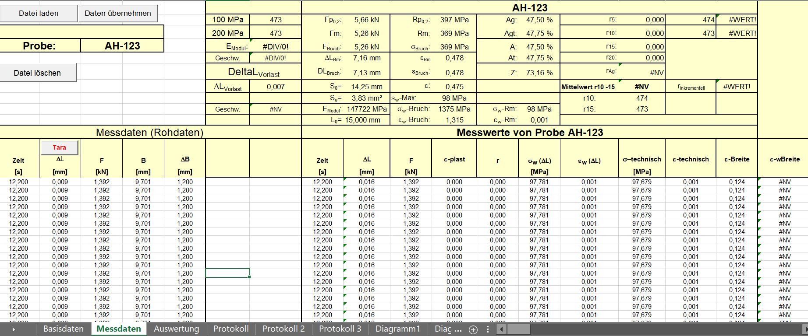
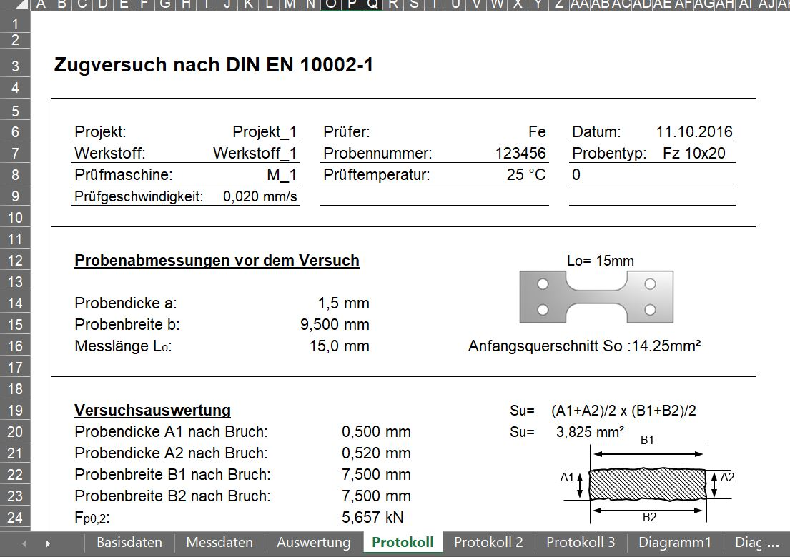

# Excel file with metadata and time series

```{note}
This example is building up on the previous one about the [CSV file with metadata and time series](1_csv.md).
Please start from this chapter in order to fully understand the content of this example.
```

## General understanding

In this example, we want to transfor an excel file which encorporates stress/strain of the measurement and some metadata about the experiment into an RDF repesentation.

For this purpose, we are describing the **general metadata** of the experiment as well as the **metadata of the time series**.

## The inputs

In this example we will consider the following inputs:

* the excel file produced by the tensile test machine
* the mapping for describing the data in RDF
* the additional triples (optional) for describing additional concepts in RDF which are not contained in the excel file

Since excel files do not have any tab separators in order to be read, we do not need any additional parser arguments at this point.

In some cases, measurement units are referenced in the macros of the individual cells of the excel file and hence have to be extracted from there. For this purpose, we can use set `parser_args={"units_from_macros": True, "unit_macro_location": -1}` when a potential unit is located in the last macro of the cell. However, this does not apply in this example and hence will be neglected here.

### The raw data

The excel file produced by the tensile test machine looks like this:





Again, we are facing metadata of the experiment like e.g. `Projekt`, `Prüfer`, `Werkstoff`, etc. and time series with the quantities of `Zeit`, `F`, `B`, which need to be mapped to ontological concepts.

The original file can be accessed [here](https://github.com/MI-FraunhoferIWM/data2rdf/raw/enh/annotations/tests/abox/xls_pipeline_test/input/data/AFZ1-Fz-S1Q.xlsm).


### The mapping

In contrast to the previous CSV example, we have to provide more information about the location of the data in the excel file. Previously, we simply had to provide the `key` of the concept in the data file. But since we are using `openpyxl`, we need to provide the `worksheet`, `value_location` (in case of metadata), `time_series_start` (in case of time series) and `unit_location` (in case of quantitative data) for each concept in the excel file.

A valid mapping for the example file show above may look like this:

<blockQuote>
<Details>
<summary><b>Click here to expand</b></summary>

```
[
  {
    "iri": "https://w3id.org/steel/ProcessOntology/Remark",
    "key": "Bemerkungen",
    "value_location": "UU31",
    "worksheet": "Protokoll"
  },
  {
    "iri": "https://w3id.org/steel/ProcessOntology/WidthChange",
    "key": "Breiten\u00e4nderung",
    "time_series_start": "E15",
    "unit_location": "E14",
    "worksheet": "Messdaten"
  },
  {
    "iri": "https://w3id.org/steel/ProcessOntology/TimeStamp",
    "key": "Datum",
    "value_location": "AD6",
    "worksheet": "Protokoll"
  },
  {
    "iri": "https://w3id.org/steel/ProcessOntology/Elongation",
    "key": "Dehnung",
    "time_series_start": "Q15",
    "unit": "\u00f7",
    "worksheet": "Messdaten"
  },
  {
    "iri": "https://w3id.org/steel/ProcessOntology/OriginalGaugeLength",
    "key": "Messl\u00e4nge Standardweg",
    "unit_location": "P16",
    "value_location": "M16",
    "worksheet": "Protokoll"
  },
  {
    "iri": "https://w3id.org/steel/ProcessOntology/SpecimenWidth",
    "key": "Probenbreite b",
    "unit_location": "P15",
    "value_location": "M15",
    "worksheet": "Protokoll"
  },
  {
    "iri": "https://w3id.org/steel/ProcessOntology/SpecimenThickness",
    "key": "Probendicke a",
    "unit_location": "P14",
    "value_location": "M14",
    "worksheet": "Protokoll"
  },
  {
    "iri": "https://w3id.org/steel/ProcessOntology/SpecimenType",
    "key": "Probenform",
    "value_location": "AE7",
    "worksheet": "Protokoll"
  },
  {
    "iri": "https://w3id.org/steel/ProcessOntology/SampleIdentifier-2",
    "key": "Probenkennung 2",
    "value_location": "U7",
    "worksheet": "Protokoll"
  },
  {
    "iri": "https://w3id.org/steel/ProcessOntology/ProjectNumber",
    "key": "Projekt",
    "value_location": "F6",
    "worksheet": "Protokoll"
  },
  {
    "iri": "https://w3id.org/steel/ProcessOntology/Tester",
    "key": "Pr\u00fcfer",
    "value_location": "U6",
    "worksheet": "Protokoll"
  },
  {
    "iri": "https://w3id.org/steel/ProcessOntology/TestingRate",
    "key": "Pr\u00fcfgeschwindigkeit",
    "value_location": "J9",
    "worksheet": "Protokoll"
  },
  {
    "iri": "https://w3id.org/steel/ProcessOntology/MachineData",
    "key": "Pr\u00fcfmaschine",
    "value_location": "I8",
    "worksheet": "Protokoll"
  },
  {
    "iri": "https://w3id.org/steel/ProcessOntology/Temperature",
    "key": "Pr\u00fcftemperatur",
    "value_location": "U8",
    "worksheet": "Protokoll"
  },
  {
    "iri": "https://w3id.org/steel/ProcessOntology/StandardForce",
    "key": "Standardkraft",
    "time_series_start": "C15",
    "unit_location": "C14",
    "worksheet": "Messdaten"
  },
  {
    "iri": "https://w3id.org/steel/ProcessOntology/Extension",
    "key": "Standardweg",
    "time_series_start": "D15",
    "unit_location": "D14",
    "worksheet": "Messdaten"
  },
  {
    "iri": "https://w3id.org/steel/ProcessOntology/AbsoluteCrossheadTravel",
    "key": "Traversenweg absolut",
    "time_series_start": "B15",
    "unit_location": "B14",
    "worksheet": "Messdaten"
  },
  {
    "annotation": "https://w3id.org/steel/ProcessOntology",
    "iri": "https://w3id.org/steel/ProcessOntology/Material",
    "key": "Werkstoff",
    "value_location": "H7",
    "worksheet": "Protokoll"
  },
  {
    "iri": "https://w3id.org/steel/ProcessOntology/TestTime",
    "key": "Zeit",
    "time_series_start": "A15",
    "unit_location": "A14",
    "worksheet": "Messdaten"
  }
]
```

Please note that a mapping for a metadatum looks like this:
```
...
{
"iri": "https://w3id.org/steel/ProcessOntology/OriginalGaugeLength",
"key": "Messl\u00e4nge Standardweg",
"unit_location": "P16",
"value_location": "M16",
"worksheet": "Protokoll"
}
...
```

Whereas the mapping of a time series looks like this:

```
{
"iri": "https://w3id.org/steel/ProcessOntology/TestTime",
"key": "Zeit",
"time_series_start": "A15",
"unit_location": "A14",
"worksheet": "Messdaten"
}
```

Again, the `unit_location` is only needed if the concept is a quantity, of course.

In case if the unit cannot be parsed from the excel sheet, we again have the opportunity to specify the unit in the mapping:

```
...
{
    "iri": "https://w3id.org/steel/ProcessOntology/Elongation",
    "key": "Dehnung",
    "time_series_start": "Q15",
    "unit": "\u00f7",
    "worksheet": "Messdaten"
  }
...
```

Please note the that unit is a unicode charater for the \u00f7 (fraction) - symbol. The related ontological concept for the unit will be queried from the **QUDT** ontology again from this symbol. Alternatively, you may also specify the URI (e.g. `http://qudt.org/vocab/unit/FRACTION`). For other units with simpler symbols (e.g. `mm`), you will not need the unicode representation.

### The additional triples (optional)

The method graph for this example is almost the same as from the previous csv-example. The reason is that we are still describing a tensile test with the same ontological concepts, which will result into similar IRIs with the same suffix:
<blockQuote>
<Details>
<summary><b>Click here to expand</b></summary>

```
@prefix rdf: <http://www.w3.org/1999/02/22-rdf-syntax-ns#> .
@prefix rdfs: <http://www.w3.org/2000/01/rdf-schema#> .
@prefix prov: <http://www.w3.org/ns/prov#> .
@prefix fileid: <http://abox-namespace-placeholder.org/> .

#  Describe the Tester and the Facility and lab

fileid:TestingFacility rdf:type prov:Organization , prov:Location .

fileid:TestingLab rdf:type prov:Location, prov:Agent ;
                  prov:atLocation fileid:TestingFacility .

fileid:Tester rdf:type prov:Agent ;
              prov:actedOnBehalfOf fileid:TestingFacility ;
              prov:atLocation fileid:TestingLab .

fileid:Temperature rdf:type prov:Entity ;
                   prov:wasAttributedTo fileid:TestingLab .


# describe the project

fileid:Project rdf:type prov:Activity ;
               prov:wasAssociatedWith fileid:TestingFacility ;
               prov:generated fileid:ProjectName ,
                              fileid:ProjectNumber .

fileid:ProjectName rdf:type prov:Entity .

fileid:ProjectNumber rdf:type prov:Entity .


# Describe the Specimen and its attributes

fileid:SamplePreparatation rdf:type prov:Activity ;
                           prov:wasAssociatedWith fileid:TensileTestSpecimen ,
                                                  fileid:Material ;
                           prov:generated fileid:ParallelLength ,
                                          fileid:SpecimenThickness ,
                                          fileid:SpecimenType ,
                                          fileid:SpecimenWidth ;
                           prov:wasInfluencedBy fileid:Project .

fileid:TensileTestSpecimen rdf:type prov:Agent , prov:Entity .

fileid:Material rdf:type prov:Agent .

fileid:ParallelLength rdf:type prov:Entity ;
                      prov:wasAttributedTo fileid:TensileTestSpecimen .

fileid:SpecimenThickness rdf:type prov:Entity ;
                         prov:wasAttributedTo fileid:TensileTestSpecimen .

fileid:SpecimenType rdf:type prov:Entity ;
                    prov:wasAttributedTo fileid:TensileTestSpecimen .

fileid:SpecimenWidth rdf:type prov:Entity ;
                    prov:wasAttributedTo fileid:TensileTestSpecimen .

# Describe the experiment preparation

fileid:ExperimentPreparation rdf:type prov:Activity ;
                             prov:atLocation fileid:TestingLab ;
                             prov:wasAssociatedWith fileid:Tester ,
                                                    fileid:ForceMeasuringDevice ,
                                                    fileid:DisplacementTransducer ,
                                                    fileid:TensileTestSpecimen ,
                                                    fileid:TensileTestingMachine ;
                             prov:generated fileid:Preload ,
                                            fileid:OriginalGaugeLength ,
                                            fileid:TestingRate ;
                            prov:wasInfluencedBy fileid:SamplePreparatation .

fileid:TensileTestingMachine rdf:type prov:Agent, prov:Entity ;
                             prov:atLocation fileid:TestingLab .

fileid:ForceMeasuringDevice rdf:type prov:Agent, prov:Entity ;
                            prov:atLocation fileid:TestingLab .

fileid:DisplacementTransducer rdf:type prov:Agent , prov:Entity ;
                              prov:atLocation fileid:TestingLab .

fileid:TestingRate rdf:type prov:Entity ;
                   prov:wasAttributedTo fileid:TensileTestingMachine .

fileid:Preload rdf:type prov:Entity ;
               prov:wasAttributedTo fileid:TensileTestingMachine .

fileid:OriginalGaugeLength rdf:type prov:Entity ;
                           prov:wasAttributedTo fileid:DisplacementTransducer .


# Describe the experiment and its data produced by which device

fileid:dataset rdf:type prov:Entity .

fileid:TensileTestExperiment rdf:type prov:Activity ;
    prov:wasAssociatedWith fileid:Tester ;
    prov:used fileid:TensileTestSpecimen ,
              fileid:TensileTestingMachine ,
              fileid:ForceMeasuringDevice ,
              fileid:DisplacementTransducer ,
              fileid:TestingFacility ;
    prov:generated fileid:Extension ,
                   fileid:StandardForce ,
                   fileid:AbsoluteCrossheadTravel ,
                   fileid:Remark ,
                   fileid:TimeStamp ,
                   fileid:dataset ;
    prov:hadPlan fileid:TestStandard ;
    prov:wasInfluencedBy fileid:ExperimentPreparation .

fileid:AbsoluteCrossheadTravel rdf:type prov:Entity;
                               prov:wasDerivedFrom fileid:DisplacementTransducer .

fileid:StandardForce rdf:type prov:Entity ;
                     prov:wasDerivedFrom fileid:ForceMeasuringDevice .

fileid:Extension rdf:type prov:Entity ;
                 prov:wasDerivedFrom fileid:DisplacementTransducer .

fileid:TestingStandard rdf:type prov:Plan .

```

</Details>
</blockQuote>

## Running the pipeline

```{note}
For readability, we are truncating the mapping as well as the additional triples. This will be indicated by `...`. In order to execute the code properly, please go the related jupyter notebook or copy the full content of the inputs above.
```

In order to apply the pipeline to the Excel file, run the following Python code:

```
from data2rdf import Data2RDF, Parser

mapping = [
  {
    "iri": "https://w3id.org/steel/ProcessOntology/Remark",
    "key": "Bemerkungen",
    "value_location": "UU31",
    "worksheet": "Protokoll"
  },
  {
    "iri": "https://w3id.org/steel/ProcessOntology/WidthChange",
    "key": "Breiten\u00e4nderung",
    "time_series_start": "E15",
    "unit_location": "E14",
    "worksheet": "Messdaten"
  },

  ...

]

additional_triples="""
@prefix rdf: <http://www.w3.org/1999/02/22-rdf-syntax-ns#> .
@prefix rdfs: <http://www.w3.org/2000/01/rdf-schema#> .
@prefix prov: <http://www.w3.org/ns/prov#> .
@prefix fileid: <http://abox-namespace-placeholder.org/> .

#  Describe the Tester and the Facility and lab

fileid:TestingFacility rdf:type prov:Organization , prov:Location .

fileid:TestingLab rdf:type prov:Location, prov:Agent ;
                  prov:atLocation fileid:TestingFacility .

fileid:Tester rdf:type prov:Agent ;
              prov:actedOnBehalfOf fileid:TestingFacility ;
              prov:atLocation fileid:TestingLab .

fileid:Temperature rdf:type prov:Entity ;
                   prov:wasAttributedTo fileid:TestingLab .

...
"""

data2rdf = Data2RDF(
    raw_file="path/to/file.xlsx",
    mapping=mapping,
    additional_triples=additional_triples,
    parser=Parser.excel,
)
```

## The output

When the pipeline run is succeded, you see the following output by running `print(pipeline.graph.serialize())`:

<blockquote>
<Details>
<summary><b>Click here to expand</b></summary>

```
@prefix csvw: <http://www.w3.org/ns/csvw#> .
@prefix dcat: <http://www.w3.org/ns/dcat#> .
@prefix dcterms: <http://purl.org/dc/terms/> .
@prefix fileid: <https://www.example.org/> .
@prefix foaf1: <http://xmlns.com/foaf/spec/> .
@prefix prov: <http://www.w3.org/ns/prov#> .
@prefix qudt: <http://qudt.org/schema/qudt/> .
@prefix rdfs: <http://www.w3.org/2000/01/rdf-schema#> .
@prefix xsd: <http://www.w3.org/2001/XMLSchema#> .

fileid:TensileTestExperiment a prov:Activity ;
    prov:generated fileid:AbsoluteCrossheadTravel,
        fileid:Extension,
        fileid:Remark,
        fileid:StandardForce,
        fileid:TimeStamp,
        fileid:dataset ;
    prov:hadPlan fileid:TestStandard ;
    prov:used fileid:DisplacementTransducer,
        fileid:ForceMeasuringDevice,
        fileid:TensileTestSpecimen,
        fileid:TensileTestingMachine,
        fileid:TestingFacility ;
    prov:wasAssociatedWith fileid:Tester ;
    prov:wasInfluencedBy fileid:ExperimentPreparation .

fileid:TestingStandard a prov:Plan .

fileid:ExperimentPreparation a prov:Activity ;
    prov:atLocation fileid:TestingLab ;
    prov:generated fileid:OriginalGaugeLength,
        fileid:Preload,
        fileid:TestingRate ;
    prov:wasAssociatedWith fileid:DisplacementTransducer,
        fileid:ForceMeasuringDevice,
        fileid:TensileTestSpecimen,
        fileid:TensileTestingMachine,
        fileid:Tester ;
    prov:wasInfluencedBy fileid:SamplePreparatation .

fileid:MachineData a <https://w3id.org/steel/ProcessOntology/MachineData> ;
    rdfs:label "M_1" .

fileid:ParallelLength a prov:Entity ;
    prov:wasAttributedTo fileid:TensileTestSpecimen .

fileid:PercentageElongation a <https://w3id.org/steel/ProcessOntology/PercentageElongation> ;
    qudt:hasUnit "http://qudt.org/vocab/unit/FRACTION"^^xsd:anyURI .

fileid:Preload a prov:Entity ;
    prov:wasAttributedTo fileid:TensileTestingMachine .

fileid:Project a prov:Activity ;
    prov:generated fileid:ProjectName,
        fileid:ProjectNumber ;
    prov:wasAssociatedWith fileid:TestingFacility .

fileid:ProjectName a prov:Entity .

fileid:SampleIdentifier-2 a <https://w3id.org/steel/ProcessOntology/SampleIdentifier-2> ;
    rdfs:label "123456" .

fileid:SamplePreparatation a prov:Activity ;
    prov:generated fileid:ParallelLength,
        fileid:SpecimenThickness,
        fileid:SpecimenType,
        fileid:SpecimenWidth ;
    prov:wasAssociatedWith fileid:Material,
        fileid:TensileTestSpecimen ;
    prov:wasInfluencedBy fileid:Project .

fileid:Temperature a prov:Entity,
        <https://w3id.org/steel/ProcessOntology/Temperature> ;
    rdfs:label "25" ;
    prov:wasAttributedTo fileid:TestingLab .

fileid:TestTime a <https://w3id.org/steel/ProcessOntology/TestTime> ;
    qudt:hasUnit "http://qudt.org/vocab/unit/SEC"^^xsd:anyURI .

fileid:WidthChange a <https://w3id.org/steel/ProcessOntology/WidthChange> ;
    qudt:hasUnit "http://qudt.org/vocab/unit/MilliM"^^xsd:anyURI .

fileid:dataset a dcat:Dataset,
        prov:Entity ;
    dcterms:hasPart fileid:tableGroup ;
    dcat:distribution [ a dcat:Distribution ;
            dcat:accessURL "https://www.example.org/download"^^xsd:anyURI ;
            dcat:mediaType "https://www.iana.org/assignments/media-types/application/vnd.ms-excel"^^xsd:anyURI ] .

fileid:tableGroup a csvw:TableGroup ;
    csvw:table [ a csvw:Table ;
            rdfs:label "Metadata" ;
            csvw:row [ a csvw:Row ;
                    csvw:describes fileid:Tester ;
                    csvw:titles "Prüfer"^^xsd:string ],
                [ a csvw:Row ;
                    csvw:describes fileid:SpecimenType ;
                    csvw:titles "Probenform"^^xsd:string ],
                [ a csvw:Row ;
                    csvw:describes fileid:TimeStamp ;
                    csvw:titles "Datum"^^xsd:string ],
                [ a csvw:Row ;
                    qudt:quantity fileid:SpecimenThickness ;
                    csvw:titles "Probendicke a"^^xsd:string ],
                [ a csvw:Row ;
                    csvw:describes fileid:Temperature ;
                    csvw:titles "Prüftemperatur"^^xsd:string ],
                [ a csvw:Row ;
                    csvw:describes fileid:MachineData ;
                    csvw:titles "Prüfmaschine"^^xsd:string ],
                [ a csvw:Row ;
                    qudt:quantity fileid:SpecimenWidth ;
                    csvw:titles "Probenbreite b"^^xsd:string ],
                [ a csvw:Row ;
                    qudt:quantity fileid:OriginalGaugeLength ;
                    csvw:titles "Messlänge Standardweg"^^xsd:string ],
                [ a csvw:Row ;
                    csvw:describes fileid:Material ;
                    csvw:titles "Werkstoff"^^xsd:string ],
                [ a csvw:Row ;
                    csvw:describes fileid:SampleIdentifier-2 ;
                    csvw:titles "Probenkennung 2"^^xsd:string ],
                [ a csvw:Row ;
                    csvw:describes fileid:TestingRate ;
                    csvw:titles "Prüfgeschwindigkeit"^^xsd:string ],
                [ a csvw:Row ;
                    csvw:describes fileid:ProjectNumber ;
                    csvw:titles "Projekt"^^xsd:string ] ],
        [ a csvw:Table ;
            rdfs:label "Time series data" ;
            csvw:tableSchema [ a csvw:Schema ;
                    csvw:column [ a csvw:Column ;
                            qudt:quantity fileid:WidthChange ;
                            csvw:titles "Breitenänderung"^^xsd:string ;
                            foaf1:page [ a foaf1:Document ;
                                    dcterms:format "https://www.iana.org/assignments/media-types/application/json"^^xsd:anyURI ;
                                    dcterms:identifier "https://www.example.org/column-4"^^xsd:anyURI ;
                                    dcterms:type "http://purl.org/dc/terms/Dataset"^^xsd:anyURI ] ],
                        [ a csvw:Column ;
                            qudt:quantity fileid:TestTime ;
                            csvw:titles "Zeit"^^xsd:string ;
                            foaf1:page [ a foaf1:Document ;
                                    dcterms:format "https://www.iana.org/assignments/media-types/application/json"^^xsd:anyURI ;
                                    dcterms:identifier "https://www.example.org/column-0"^^xsd:anyURI ;
                                    dcterms:type "http://purl.org/dc/terms/Dataset"^^xsd:anyURI ] ],
                        [ a csvw:Column ;
                            qudt:quantity fileid:PercentageElongation ;
                            csvw:titles "Dehnung"^^xsd:string ;
                            foaf1:page [ a foaf1:Document ;
                                    dcterms:format "https://www.iana.org/assignments/media-types/application/json"^^xsd:anyURI ;
                                    dcterms:identifier "https://www.example.org/column-5"^^xsd:anyURI ;
                                    dcterms:type "http://purl.org/dc/terms/Dataset"^^xsd:anyURI ] ],
                        [ a csvw:Column ;
                            qudt:quantity fileid:Extension ;
                            csvw:titles "Standardweg"^^xsd:string ;
                            foaf1:page [ a foaf1:Document ;
                                    dcterms:format "https://www.iana.org/assignments/media-types/application/json"^^xsd:anyURI ;
                                    dcterms:identifier "https://www.example.org/column-3"^^xsd:anyURI ;
                                    dcterms:type "http://purl.org/dc/terms/Dataset"^^xsd:anyURI ] ],
                        [ a csvw:Column ;
                            qudt:quantity fileid:AbsoluteCrossheadTravel ;
                            csvw:titles "Traversenweg absolut"^^xsd:string ;
                            foaf1:page [ a foaf1:Document ;
                                    dcterms:format "https://www.iana.org/assignments/media-types/application/json"^^xsd:anyURI ;
                                    dcterms:identifier "https://www.example.org/column-2"^^xsd:anyURI ;
                                    dcterms:type "http://purl.org/dc/terms/Dataset"^^xsd:anyURI ] ],
                        [ a csvw:Column ;
                            qudt:quantity fileid:StandardForce ;
                            csvw:titles "Standardkraft"^^xsd:string ;
                            foaf1:page [ a foaf1:Document ;
                                    dcterms:format "https://www.iana.org/assignments/media-types/application/json"^^xsd:anyURI ;
                                    dcterms:identifier "https://www.example.org/column-1"^^xsd:anyURI ;
                                    dcterms:type "http://purl.org/dc/terms/Dataset"^^xsd:anyURI ] ] ] ] .

fileid:AbsoluteCrossheadTravel a prov:Entity,
        <https://w3id.org/steel/ProcessOntology/AbsoluteCrossheadTravel> ;
    qudt:hasUnit "http://qudt.org/vocab/unit/MilliM"^^xsd:anyURI ;
    prov:wasDerivedFrom fileid:DisplacementTransducer .

fileid:Extension a prov:Entity,
        <https://w3id.org/steel/ProcessOntology/Extension> ;
    qudt:hasUnit "http://qudt.org/vocab/unit/MilliM"^^xsd:anyURI ;
    prov:wasDerivedFrom fileid:DisplacementTransducer .

fileid:Material a prov:Agent,
        <https://w3id.org/steel/ProcessOntology/Material>,
        <https://w3id.org/steel/ProcessOntology/Werkstoff_1> ;
    rdfs:label "Werkstoff_1" .

fileid:OriginalGaugeLength a prov:Entity,
        <https://w3id.org/steel/ProcessOntology/OriginalGaugeLength> ;
    qudt:hasUnit "http://qudt.org/vocab/unit/MilliM"^^xsd:anyURI ;
    qudt:value "15.0"^^xsd:float ;
    prov:wasAttributedTo fileid:DisplacementTransducer .

fileid:ProjectNumber a prov:Entity,
        <https://w3id.org/steel/ProcessOntology/ProjectNumber> ;
    rdfs:label "Projekt_1" .

fileid:SpecimenThickness a prov:Entity,
        <https://w3id.org/steel/ProcessOntology/SpecimenThickness> ;
    qudt:hasUnit "http://qudt.org/vocab/unit/MilliM"^^xsd:anyURI ;
    qudt:value "1.5"^^xsd:float ;
    prov:wasAttributedTo fileid:TensileTestSpecimen .

fileid:SpecimenType a prov:Entity,
        <https://w3id.org/steel/ProcessOntology/SpecimenType> ;
    rdfs:label "Fz 10x20" ;
    prov:wasAttributedTo fileid:TensileTestSpecimen .

fileid:SpecimenWidth a prov:Entity,
        <https://w3id.org/steel/ProcessOntology/SpecimenWidth> ;
    qudt:hasUnit "http://qudt.org/vocab/unit/MilliM"^^xsd:anyURI ;
    qudt:value "9.5"^^xsd:float ;
    prov:wasAttributedTo fileid:TensileTestSpecimen .

fileid:StandardForce a prov:Entity,
        <https://w3id.org/steel/ProcessOntology/StandardForce> ;
    qudt:hasUnit "http://qudt.org/vocab/unit/KiloN"^^xsd:anyURI ;
    prov:wasDerivedFrom fileid:ForceMeasuringDevice .

fileid:TestingRate a prov:Entity,
        <https://w3id.org/steel/ProcessOntology/TestingRate> ;
    rdfs:label "0.02" ;
    prov:wasAttributedTo fileid:TensileTestingMachine .

fileid:TimeStamp a <https://w3id.org/steel/ProcessOntology/TimeStamp> ;
    rdfs:label "2016-10-11 00:00:00" .

fileid:ForceMeasuringDevice a prov:Agent,
        prov:Entity ;
    prov:atLocation fileid:TestingLab .

fileid:Tester a prov:Agent,
        <https://w3id.org/steel/ProcessOntology/Tester> ;
    rdfs:label "Fe" ;
    prov:actedOnBehalfOf fileid:TestingFacility ;
    prov:atLocation fileid:TestingLab .

fileid:TensileTestingMachine a prov:Agent,
        prov:Entity ;
    prov:atLocation fileid:TestingLab .

fileid:TestingFacility a prov:Location,
        prov:Organization .

fileid:DisplacementTransducer a prov:Agent,
        prov:Entity ;
    prov:atLocation fileid:TestingLab .

fileid:TestingLab a prov:Agent,
        prov:Location ;
    prov:atLocation fileid:TestingFacility .

fileid:TensileTestSpecimen a prov:Agent,
        prov:Entity .
```

</Details>
</blockQuote>

Again, you will be able to investigate the `general_metadata`, `plain_metadata`, `time_series_metadata` and `time_series` attributes in the same way as stated in the [first example](1_csv).
