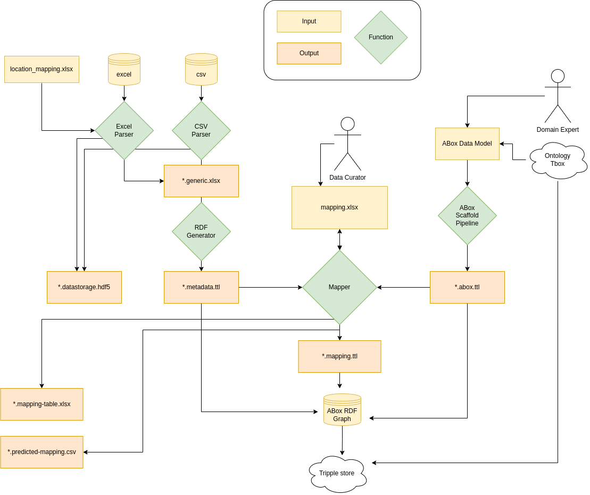
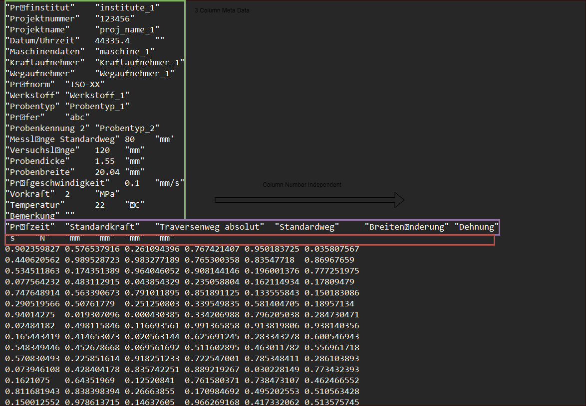
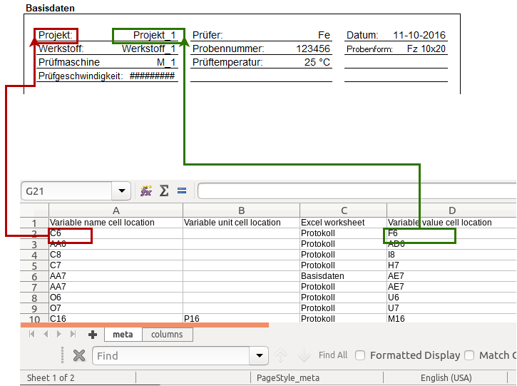
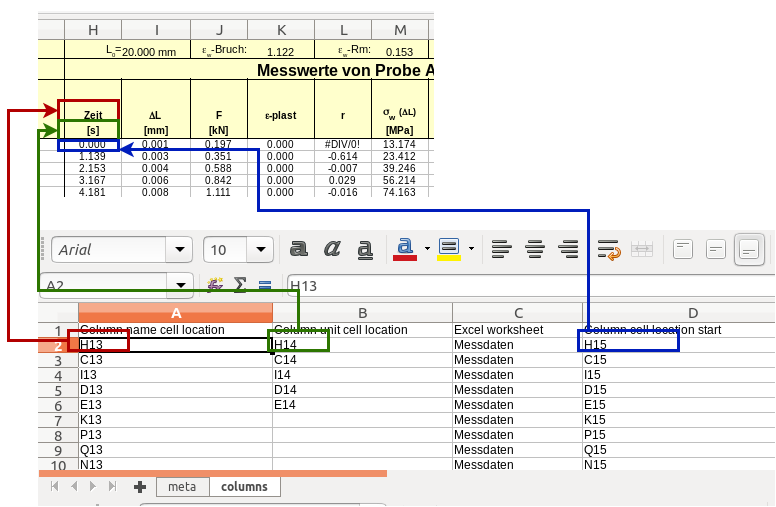
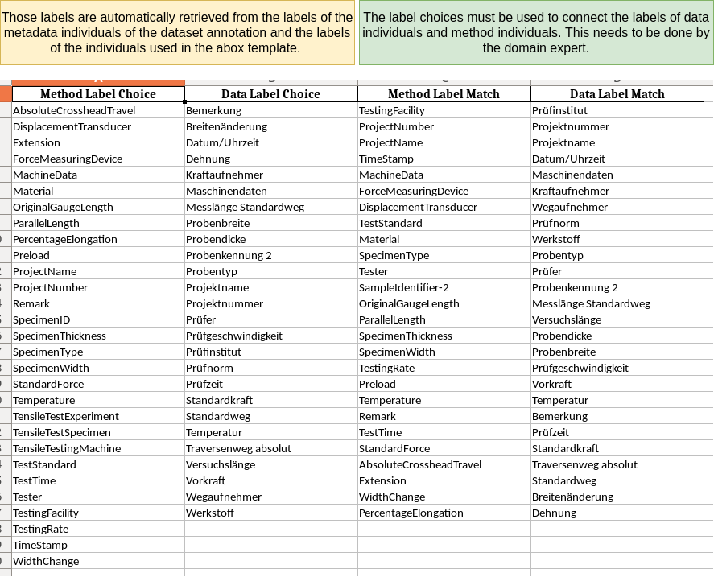

# Overview



## Input files

- **excel/csv** Raw data files that should be ontologically annotated.
- **mapping.xlsx** An excel file, that maps the data individuals to individuals of the abox template.
- **abox_template.drawio** Uncompressed draw.io xml template file, that describes the relations of the individuals in the abox.

## Generated files

- **.abox.ttl** A turtle file for the method graph. Generated from the abox template.
- **.datastorage.hdf5** The column data stored as HDF5 file. (Can be used to retrieve the bulk data using the labels of the column individuals in the metadata.ttl file)
- **.generic.xlsx** A generic metadata description of the data. Can be generated using the CSV or Excel parser. Is transformed to a ttl file describing the metadata of the file.
- **.mapping.ttl** A mapping graph linking the metadata individuals to the method individuals (using the owl.sameAs relation).
- **.mapping-result.xlsx** A excel file that shows the result of the mapping (which data individual is mapped to which method individual)
- **.metadata.ttl** The ttl file describing the files metadata using EMMO, rdf, dcat, xsd and EMMO-datamodel ontology.
- **.predicted-mapping.csv** A prediction of possible matches between data individuals and method individuals, based on a key_map.db. The prediction is based on a word match between the labels of the individuals and pairs of known matches. This can be used to guide the manual mapping effort. But needs human examination.

# Parser

The parser reads the meta data and column data of a input file and stores it in a generic format - the .generic.xlsx file.

- Meta data must follow the structure: Name/Value/Unit(Optional)
- Column data must follow the structure: Name/Unit(Optional)/Column Data (A column of variable length of float numbers)

```{warning}
The parser assumes that both meta data and column data is provided. If column data is missing the pipeline fails. This bug should be improved.
It's a quick fix but for the moment a workaround is to add a mock-up column with no data to the dataset.
```

## CSV Parser



The CSV Parser parses the meta data represented in rows on top of the actual column data. The parser expects the meta data to be represented as 3 columns [Name/Value/Unit(Optional)] where the unit does not have to be present. After the meta data the column data is parsed.
The number of columns is variable. The parser requires, that the column separator of the meta data **header_sep**, the number of meta data rows **column_sep** and the separator of the columns **column_sep** are supplied as arguments as shown in the example below.

```python
working_folder = os.path.join("tests", "tensile_test_example")
output_folder = os.path.join(working_folder,"output")

template = os.path.join(abox_folder_path, "tensile_test_method_v6","tensile_test_method_v6.mod.ttl")
mapping_file = os.path.join(working_folder,"tensile_test_mapping.xlsx")
raw_data = os.path.join(working_folder,"DX56_D_FZ2_WR00_43.TXT")

parser = "csv"
parser_args = {
      "header_sep":"\t",
      "column_sep":"\t",
      "header_length":20
   }

pipeline = Annotation_Pipeline(
    raw_data,
    parser,
    parser_args,
    template,
    mapping_file,
    output_folder,
    mapping_db_path,
)

pipeline.run_pipeline()
```

Source: <https://gitlab.cc-asp.fraunhofer.de/rdf-pipeline/rdf-pipeline/-/blob/main/data2rdf/pipeline_demo.ipynb>

## Excel Parser

Since excel data can be arbitrarily complex structured, an additional location mapping file is needed, that enables
the parser to locate the required fields. Examples of how this location mapping file locates the required files are shown below.



The location mapping for the meta data needs to provides the field location of the
Name, Value and Unit(Optional) of the specific meta data as well as the worksheet.
If the Unit location is not supplied, the parser will also try to extract the unit from the cell macro of the value filed.



The column location mapping does not need to provide the end of the column. It is determined automatically.

## RDF Generator

### Generic format

Both parsers convert the meta data and column data into a intermediate generic excel format, which is used to generate a RDF representation of the data. The advantage of the intermediate format is, that the data parsed with both parsers can be converted into RDF with the same RDF generator
class.

### RDF conversion

The RDF representation of the data describes it using standard RDF vocabularies, such as dcat (for the file path) and rdfs (for the labels).
The meta data is represented as individuals of <http://emmo.info/datamodel#Metadata> and columns as individuals of <http://emmo.info/datamodel#DataInstance> .
The units and quantities are described using EMMO.

An example of the metadata RDF representation is shown below.

```
fileid:dataset a dcat:Dataset ;
    ns3:composition fileid:column-0,
        fileid:column-1,
        fileid:column-2,

        ...

        fileid:metadata-0,

        ...

        fileid:metadata-8,
        fileid:metadata-9 ;
    dcat:downloadURL "tests/tensile_test_example/DX56_D_FZ2_WR00_43.TXT" .

    ...

fileid:column-0 a ns3:DataInstance ;
    rdfs:label "Prüfzeit" ;
    ns1:EMMO_67fc0a36_8dcb_4ffa_9a43_31074efa3296 fileid:unit-0,
        fileid:unitliteral-0 .

```

### Unit assignment

For the unit mapping a simple function is used that assigns EMMO unit individuals to corresponding unit strings.
E.g. if the parser finds the unit **m** it will add the unit individual of the EMMO Class Metre.

### Relations between data individuals

This represents the data only as metadata and datainstance individuals, without any relation between those instances.
The individuals need to be mapped to the abox skeleton representing the method graph of the experiment to add relations between the individuals.
This is what happens in the [Mapper](Data-Method Mapping) workflow.

# ABox skeleton

The relations between the individuals as well as the ontological parent classes cannot be automatically derived from the dataset.
This information needs to be based on the TBox of the ontology(ies) that should be used to annotate the dataset.
A domain expert needs to supply this information. In order to make the design of this data model as simple as possible
a template based approach is used in this pipeline, that is based on [draw.io](https://app.diagrams.net/), [Chowlk](https://chowlk.linkeddata.es/)
and [ontopanel](https://yuechenbam.github.io/src/main/webapp/index.html).
The domain experts can draw a template (also referred to as skeleton) of the abox in draw.io using the chowlk convention.
This template shows how the individuals are connected to each other and what the parent class of each individuals is.

The individuals of the template are converted to unique individuals with a provided namespace, to make sure, that each dataset is represented with a unique set of individuals.

The namespace is provided with the `base_iri` argument.

```python
pipeline = AnnotationPipeline(
    raw_data,
    parser,
    parser_args,
    template,
    mapping_file,
    output_folder,
    base_iri = f"https://stahldigital.materials-data.space/{file_id}",
    data_download_iri = f"https://127.0.0.1/api/knowledge/data_api/{file_id}"
)
```

Create the abox template using [ontopanel](https://yuechenbam.github.io/src/main/webapp/index.html).
A detailed introduction is given in: <https://github.com/yuechenbam/yuechenbam.github.io>.
An example of a ontopanel compliant xml file is given in: <https://gitlab.cc-asp.fraunhofer.de/rdf-pipeline/minimal-example/-/blob/main/data-mapping/process_abox_template.xml>
Export the created graph and add the turtle file as `mapping_file` argument to the pipeline.

# Data-Method Mapping

The individuals of the metadata annotation need to be connected with the individuals of the abox method template so that the final graph
has the actual data literals as well as the relations between the individuals.
The mapping is done based on an excel file, where the labels of
the matching individuals are connected. The labels need to be connected by an domain expert.

An example of the mapping file for tensile test data is shown in the figure below.


The Mapping function connects the individuals by adding the _owl:sameAs_ relation between each pair of individuals.
The mapping is exported as **.mapping.ttl**. The owl:sameAs relations allows to merge the individuals virtually by
applying a reasoner (e.g. Fact++ or the allegrograph RDFS++ reasoner) on the graph.
